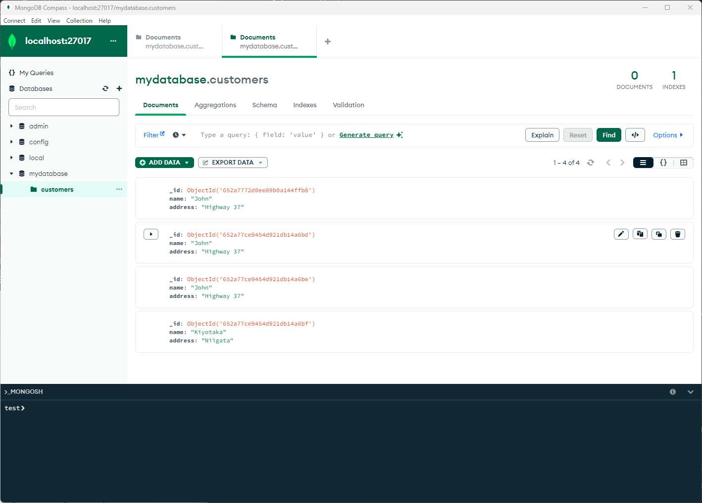
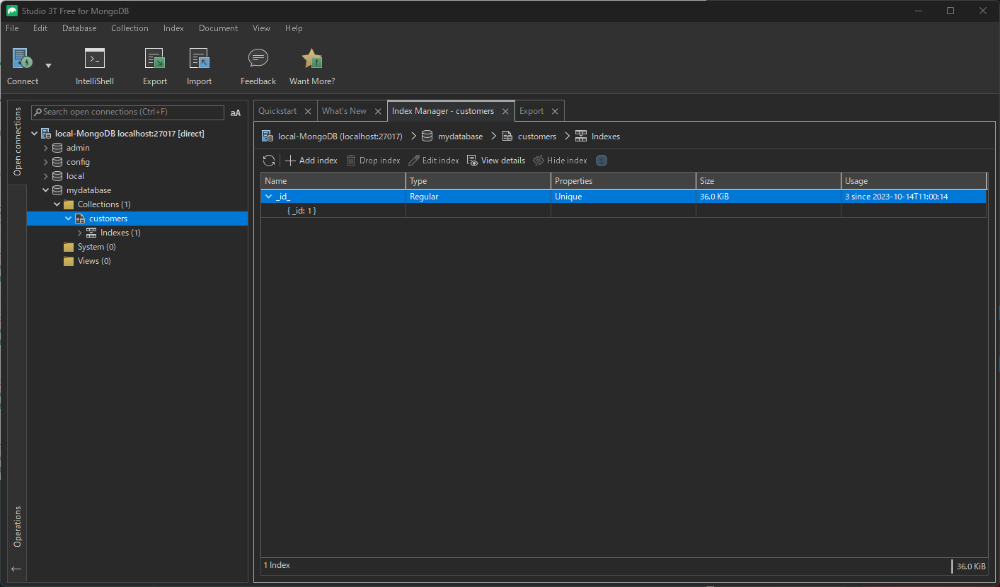

# MongoDBについて

MongoDBは、オープンソースのドキュメント指向データベースです。以下は、MongoDBに関する情報をまとめたページです。

# インストールの種別
* オンプレミス環境
* Dockerコンテナ/Docker Composer
* Kubeernetesクラスタ
* マネージドサービス
https://www.mongodb.com/ja-jp/atlas/database


## インストール方法（オンプレミス）
MongoDBのインストール方法は、以下の手順に従ってください。

1. MongoDBの公式サイトからインストーラーをダウンロードします。
https://www.mongodb.com/try/download/community
2. インストーラーを実行し、指示に従ってインストールを行います。

## インストール方法（Dockerコンテナ）
起動方法
```
docker run -d -p 27017:27017 --name mongodb -v ${pwd}/mongo_data/db:/data/db mongo --bind_ip 0.0.0.0
```
## インストール方法（Docker Composer）
起動方法
```bash
docker-compose up -d
```
# ツールでの使い方
MongoDB の内容を視覚的に確認し、管理するための多くのツールがあります。
以下にいくつかの人気のあるツールです。

1. **MongoDB Compass**:
   - MongoDBの公式GUIツールで、データの視覚的な探索やスキーマの分析、クエリパフォーマンスの最適化などができます。
   - [MongoDB Compassの公式サイト](https://www.mongodb.com/products/compass)からダウンロードできます。

2. **Robo 3T (旧 Robomongo)**:
   - オープンソースで人気のあるMongoDB管理ツールです。
   - シンプルなインターフェイスで、基本的なデータ操作やクエリ実行が可能です。
   - [Robo 3Tの公式サイト](https://robomongo.org/)からダウンロードできます。

3. **Studio 3T**:
   - Robo 3Tの上位版で、多くの高度な機能を含んでいます。
   - SQLクエリの実行、データのインポート・エクスポート、インデックスの管理などが可能です。
   - [Studio 3Tの公式サイト](https://studio3t.com/)からダウンロードできます。

4. **NoSQLBooster**:
   - 豊富な機能を持ちながら使いやすいMongoDB GUIツールです。
   - クエリビルダー、アグリゲーションエディター、MongoDBシェルなどが利用できます。
   - [NoSQLBoosterの公式サイト](https://nosqlbooster.com/)からダウンロードできます。

5. **Adminer**:
   - 複数のデータベースシステムをサポートするシンプルなデータベース管理ツールで、MongoDBもサポートしています。
   - [Adminerの公式サイト](https://www.adminer.org/)からダウンロードできます。

# Pythonでの使い方
https://github.com/kiyo7447/Python-Logic/blob/main/Section12_Database/145MongoDB_master.py

https://github.com/kiyo7447/Python-Logic/blob/main/Section12_Database/145MongoDB_transaction.py

# MongoDB Shellの使い方

## 基本的な操作方法

MongoDBの基本的な操作方法は、以下の手順に従ってください。

1. MongoDBのサーバーを起動します。
2. MongoDBのシェルを起動します。
3. データベースを作成します。
4. コレクションを作成します。
5. ドキュメントを挿入します。
6. ドキュメントを更新します。
7. ドキュメントを削除します。

## データモデリング

MongoDBのデータモデリングについては、以下の手順に従ってください。

1. データモデルを設計します。
2. コレクションを作成します。
3. ドキュメントを挿入します。

## クエリ

MongoDBのクエリについては、以下の手順に従ってください。

1. クエリを作成します。
2. クエリを実行します。

## 集計

MongoDBの集計については、以下の手順に従ってください。

1. 集計パイプラインを作成します。
2. 集計パイプラインを実行します。

## セキュリティ

MongoDBのセキュリティについては、以下の手順に従ってください。

1. ユーザーを作成します。
2. ユーザーにロールを割り当てます。

## ドライバ

MongoDBのドライバについては、以下の手順に従ってください。

1. ドライバをインストールします。
2. ドライバを使用して、MongoDBに接続します。

## シャーディング

MongoDBのシャーディングについては、以下の手順に従ってください。

1. シャードを作成します。
2. シャードキーを設定します。
3. コレクションをシャードに分割します。

## レプリケーション

MongoDBのレプリケーションについては、以下の手順に従ってください。

1. レプリカセットを作成します。
2. レプリカセットにノードを追加します。
3. レプリカセットからノードを削除します。
