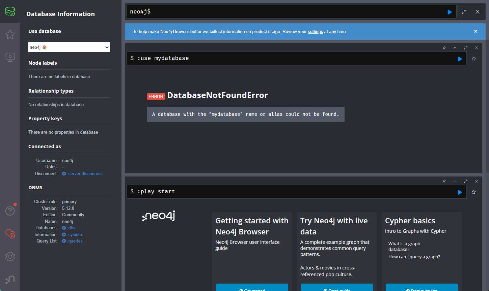

# neo4jとは
Neo4jは、グラフデータベース管理システムの一例であり、データをグラフとして格納し、クエリすることができます。以下に、Neo4jの主要な特徴と利点について説明します。
* Neo4jは、高速でスケーラブルなデータベースであり、複雑な関係性を持つデータを効率的に処理できます。
* Neo4jは、Javaで書かれており、ACIDトランザクションをサポートしています。
* Neo4jは、オープンソース版とエンタープライズ版があり、エンタープライズ版には、より高度なセキュリティ機能やクラスタリング機能が含まれています。
* Neo4jは、多くのプログラミング言語に対応しており、APIを使用してアプリケーションと連携することができます。

1. **グラフデータベース:**
   - Neo4jはグラフデータベースであり、データをノードとエッジ（関係）というグラフ構造で表現します。ノードはエンティティを、エッジはエンティティ間の関係を表します。

2. **関係のクエリ:**
   - Neo4jは、データ間の関係を効率的にクエリし、分析する能力を提供します。これは、関係の探索とパターンの識別に非常に適しています。

3. **Cypherクエリ言語:**
   - Neo4jは、グラフパターンとデータの関係を表現しクエリするための専用のデクラレーティブクエリ言語であるCypherを使用します。

4. **パフォーマンス:**
   - グラフデータベースは、関係データベースと比較して、深い関係のクエリにおいて優れたパフォーマンスを提供することができます。

5. **トランザクションのサポート:**
   - Neo4jはACID（Atomicity, Consistency, Isolation, Durability）トランザクションをサポートし、データの整合性と信頼性を保証します。

6. **柔軟性と拡張性:**
   - グラフモデルは、データの柔軟な表現を可能にし、新しいタイプのエンティティと関係を簡単に追加できます。

7. **多くの分野での利用:**
   - Neo4jは、社会ネットワーク分析、推薦システム、生物医学研究、フローの最適化など、多くの分野で利用されています。

8. **インテグレーションとエコシステム:**
   - Neo4jは、他のデータベース、データ処理フレームワーク、およびツールとのインテグレーションをサポートし、多様なエコシステムを提供します。

9. **コミュニティとサポート:**
   - Neo4jには活発なコミュニティと広範なドキュメントがあり、商業サポートも提供されています。

Neo4jは、関係の探索と分析に焦点を当てたプロジェクトにおいて、非常に有用なツールとなることがあります。また、グラフモデルを理解しやすく、グラフに基づいた問題解決のアプローチを提供します。
# 起動方法
## Dokerでの起動方法
```powershell
docker run `
    --name neo4j `
    -p7474:7474 -p7687:7687 `
    -v ${pwd}/neo4j_data/data:/data `
    -v ${pwd}/neo4j_data/logs:/logs `
    -d `
    -e NEO4J_AUTH=neo4j/password `
    neo4j
```
## Docker Composeでの起動方法
```bash
docker-compose up -d
```


# 使い方
## Console
```powershell
docker exec -it neo4j bin/cypher-shell -u neo4j -p password

CREATE (:Person {name: 'Tung Fu Rue'}),
(:Person {name: 'Duck King'}),
(:Person {name: 'Richard Myer'});

MATCH (tung:Person {name: 'Tung Fu Rue'}), (duck:Person {name: 'Duck King'}), (bill:Person {name: 'Richard Myer'})
CREATE (tung)-[:KNOWS]->(duck),
       (tung)-[:KNOWS]->(bill),
       (duck)-[:KNOWS]->(bill);

# なめを指定して削除
MATCH (n:Person {name: 'Tung Fu Rue'}) DETACH DELETE n;

# すべてを消す
MATCH (n) DETACH DELETE n;

#画像挿入
CREATE (:Person {name: 'Tung Fu Rue', image: 'https://www.google.co.jp/url?sa=i&url=https%3A%2F%2Fwww.dreamcancel.com%2Fwiki%2FThe_King_of_Fighters_XIV%2FTung_Fu_Rue&psig=AOvVaw3Dn_yoMQhge6as43T_PHOP&ust=1697441545905000&source=images&cd=vfe&ved=0CBEQjRxqFwoTCICt1tjE94EDFQAAAAAdAAAAABAE'});

#Tung Fu Rueのデータを画像表示で確認
MATCH (tung:Person {name: 'Tung Fu Rue'})
RETURN tung.name, tung.image;


neo4j@neo4j> CALL dbms.components();

+-------------------------------------------+
| name           | versions   | edition     |
+-------------------------------------------+
| "Neo4j Kernel" | ["5.12.0"] | "community" |
+-------------------------------------------+

1 row
ready to start consuming query after 27 ms, results consumed after another 0 ms

```
## Web: [Neo4j Browser](http://localhost:7474/)
```neo4j
:use system;
CREATE DATABASE 新しいデータベース名;
# Error
# Neo.ClientError.Statement.UnsupportedAdministrationCommand
# Unsupported administration command: CREATE DATABASE mydatabase;
```


## Ptython

# 参考
* 公式サイト https://neo4j.com/
